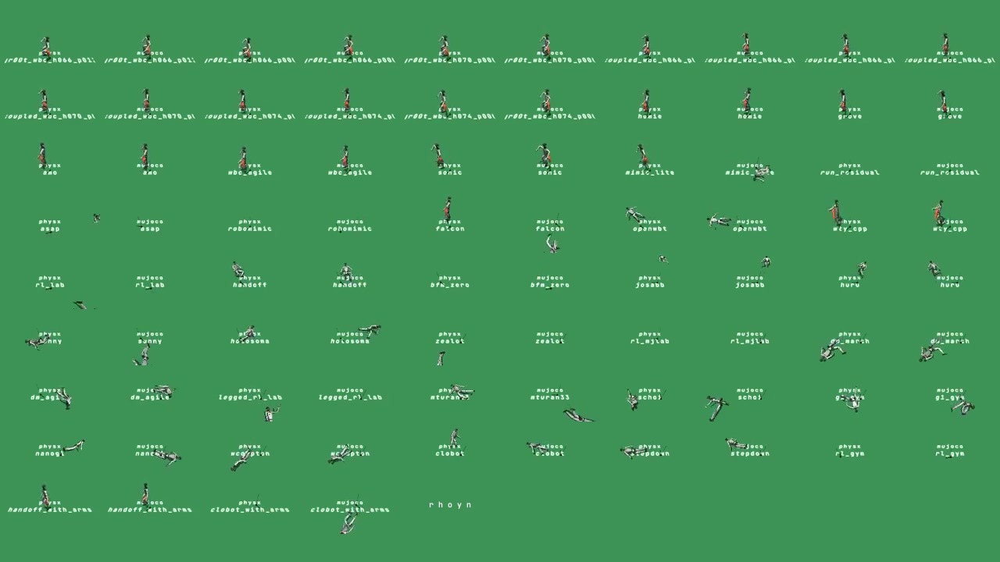

# teleop-walking-benchmark

Thirteen open-source Unitree G1 walking policies ported to one C++ interface and
scored against the same waypoint tour in MuJoCo. Twelve of the sixteen
checkpoints are committed under `policies/`; `./download_weights.sh` pulls the
other four.

The difficulty is deliberate. A benchmark every candidate completes ranks
nothing — it separates no one, it only shows the task was too easy. This one is
tuned to sit at the edge of what these policies can do: the best of them
finishes most seeds, none finishes all, and no row is a perfect score. The
punches are what make it a test of stability and disaster recovery rather than
of walking — a policy is judged on whether it can absorb a hit it never saw
coming and get back on the tour, not only on how neatly it tracks a target
while nothing is going wrong.

**The arms are not the policy's to use.** This is a benchmark for a walking
policy you sit *underneath* while you drive the upper body yourself, so every
candidate is scored on the same 15 lower-body joints — twelve in the legs, three
in the waist — and the 14 arm joints are held at `DEFAULT_ANGLES` on shared
gains for the whole tour. Nothing a policy does can move them, and nothing it
does can borrow them.

That is harder than the alternative, and deliberately so. A humanoid's arms are
a real part of how it stays upright: swing them and you can shed momentum a fall
would otherwise keep. Take them away and a policy has to hold its balance on its
legs alone. But an operator teleoperating the robot is *using* those arms to do
a task, and the walking policy underneath cannot make plans that depend on them
— a controller that needs to windmill to stay standing is a controller that
falls the moment its operator reaches for a door handle. Holding the arms still
is not a handicap the benchmark imposes for difficulty's sake; it is the
condition the policy will actually run in. That it also makes the task harder is
the point rather than the cost. `clobot` is the extreme case and is discussed
below.



https://github.com/user-attachments/assets/161f3784-ec7e-44b6-9856-8ce661bb295d

*The whole field side by side, thirteen policies on the same tour — the closing
forty-two seconds of it, by which point several have already fallen. The same
clip is `assets/preview.mp4`.*

## Running it

```sh
./download_weights.sh                    # the four checkpoints not committed here
./export_onnx.py                         # robomimic's ONNX, converted from its .pt
make
./run.sh --policy gr00t_wbc              # one candidate, one tour
./run.sh --policy gr00t_wbc --seed 7     # a different tour and punch campaign
./run.sh --policy asap --realtime 1
./run.sh --policy amo --record videos    # videos/amo.mp4
```

`--policy` is required and takes one name: a run measures one candidate. The
whole field is a loop over invocations rather than a flag, because holding
thirteen checkpoints' engines and thirteen networks' CUDA kernels in one
process costs more memory than the runs themselves — one policy per process
bounds that by construction. Without `--realtime` the run is headless and as
fast as the machine allows.

`./export_onnx.py` is only needed for `robomimic`, whose checkpoint is fetched
rather than committed and so cannot have its conversion committed either. It
needs `torch` and `onnx`; the other twelve policies run from a plain clone.

### Campaigns

A seed is a whole task rather than a repetition, so a policy is only separated
from its rivals over many of them.

```sh
./run.sh --policy gr00t_wbc --runs 500 --parallel 16
./run.sh --policy amo --seeds 100-199 --parallel 16
```

`--runs N` walks seeds 0..N-1, `--seeds A-B` an explicit range. `--parallel W`
keeps W tours in flight, one core each, sharing one scene and one CUDA context;
the memory a sweep needs is set by W rather than by the size of the field.

**Every run records itself.** Sweep or single seed, watched or headless, each
run appends to `results/result.csv` — created along with its directory if it is
not there — and `--csv FILE` only moves that somewhere else. A result that
reached nothing but a terminal is a result nobody can pool later, so there is no
flag to ask for the file and none to turn it off.

**One row is one run**, flushed as it ends so an interrupted campaign keeps
everything already finished. The header is written only to an empty file, and a
file whose header does not match is refused rather than appended to, so a
campaign resumes onto the same file but cannot interleave two schemas in one.

The row opens with the run itself — `policy`, `seed`, `outcome`, `survival_s`,
`targets`, `pos_err_cm`, `yaw_err_deg` — which is what the published table is
computed from and nothing else. The error columns are poolable across runs
because `targets` travels beside them as the weight, and a run stopped part way
is recorded as `interrupted` and is not a measurement.

What each waypoint of the tour cost follows as `s<i>_` columns, one block of ten per
target clock, twelve blocks in all. A waypoint block spans one target's clock:
`s5_` covers the stretch walked while target 5 was being asked for.

- **`s<i>_e_<group>_j`** is absolute mechanical work, the sum of `|τ·ω|·dt` over
  every 1 ms physics step of that waypoint, in joules. The absolute value is what
  makes it an actuator cost rather than a physics one — these motors burn
  current holding a limb against gravity whichever way it is moving, and a
  signed integral would let a limb swinging down pay back the lift that raised
  it.
- **`s<i>_v_<group>_krads2`** is how much the group shook: the total variation
  of each joint's angular acceleration, the sum of `|α(t) − α(t−dt)|` over the
  waypoint, added across the group, in thousands of rad/s².

Both are summed at the 1 ms physics step rather than sampled at the 50 Hz
control rate, because a policy that buzzes its ankles at 200 Hz is invisible to
anything that only looks when the policy does. Every number is written to one
decimal place, which is all any of them is worth, and the unit is in the column
name.

The twenty-nine joints are binned five ways, splitting proximal from distal in
both limbs because that is where these joints genuinely differ — the proximal
ones carry the robot's weight and do nearly all the work, while the distal ones
are light, fast and where a policy's chatter shows up first:

| group | joints | n |
|---|---|---|
| `legs_upper` | hip pitch/roll/yaw, knee — both sides | 8 |
| `legs_lower` | ankle pitch/roll — both sides | 4 |
| `waist` | waist yaw/roll/pitch | 3 |
| `arms_upper` | shoulder pitch/roll/yaw, elbow — both sides | 8 |
| `arms_lower` | wrist roll/pitch/yaw — both sides | 6 |

A run that fell leaves the waypoints it never reached empty, and **nothing marks
which waypoints ran their full clock because nothing needs to.** Waypoints `0` to
`targets - 1` each had their whole five seconds; a block present at index
`targets` is the waypoint the run died in, running from `5 × targets` seconds to
`survival_s`. Both quantities are sums over the waypoint rather than rates, so that
last partial block covers less than a target clock and should be dropped before
pooling.

`--record DIR` writes `DIR/<policy>.mp4` at 50 fps, one frame per 0.02 s of
simulated time, so playback is exactly real time however fast the run computed.
The clip carries the policy name on the floor and nothing else; a punch draws a
red arrow at the contact point, sized by the force and held for 500 ms after the
hit.

## The 10,000-seed campaign

Seeds 0-9999, every policy over every seed: **140,000 runs**, 1568 robot-hours
of simulated walking, fifteen tours in flight on an RTX 4090 / Ryzen 7 7800X3D.
No run errored and no run was interrupted, so every row in `results/result.csv`
is a measurement.

Each seed draws its own 12-target tour and its own punch campaign, so a seed is
a whole task, not a repetition — the runs are deterministic and a repeated seed
reproduces bit-identically.

Every policy is handed the same stance. The crane ramps the robot to the shared
`DEFAULT_ANGLES` pose over three seconds and then lets go, rather than to a pose
each checkpoint chose for itself, so what is measured is how well a policy takes
over from a stance it was not necessarily trained around.

| `--policy` | completed | survived | pos err | yaw err | first waypoint<br>battery energy<br>consumed | tour<br>battery energy<br>consumed | first waypoint<br>vibrations | tour<br>vibrations |
|---:|---:|---:|---:|---:|---:|---:|---:|---:|
| `gr00t_wbc` | **78.9%** | 56.7 s | 9.5 cm | 2.9° | 279.1 J | 4947.5 J | 449.9 | 6879.2 |
| `homie` | **71.0%** | 55.6 s | 17.9 cm | 34.5° | 379.9 J | 6530.0 J | 591.1 | 8654.3 |
| `amo` | **69.9%** | 54.5 s | 23.0 cm | 12.1° | 330.1 J | 5419.7 J | 622.5 | 8402.0 |
| `robomimic` | **65.2%** | 54.9 s | 11.1 cm | 3.6° | 237.2 J | 4438.4 J | 431.4 | 6577.5 |
| `asap` | **53.5%** | 52.5 s | 13.2 cm | 9.9° | 265.2 J | 4812.8 J | 425.0 | 6277.0 |
| `rl_mjlab` | **45.9%** | 51.0 s | 14.7 cm | 3.4° | 309.4 J | 5709.9 J | 440.1 | 6787.6 |
| `holosoma` | **41.7%** | 50.1 s | 18.1 cm | 3.1° | 278.5 J | 4874.0 J | 274.0 | 4932.1 |
| `run_residual` | **14.4%** | 39.2 s | 432.3 cm | 3.2° | 389.8 J | - | 493.6 | - |
| `rl_lab` | **7.3%** | 36.3 s | 13.7 cm | 65.5° | 216.5 J | - | 362.0 | - |
| `falcon` | **2.3%** | 28.3 s | 33.6 cm | 4.1° | 294.9 J | - | 440.1 | - |
| `rl_gym` | **1.1%** | 23.9 s | 57.9 cm | 6.2° | 1065.1 J | - | 3078.6 | - |
| `openwbt` | **1.0%** | 26.1 s | 10.4 cm | 35.9° | 297.3 J | - | 844.6 | - |
| `clobot` | **0.0%** | 2.2 s | - | - | - | - | - | - |
| ~~`clobot_with_arms`~~\*\* | ~~**8.6%**~~ | ~~33.1 s~~ | ~~33.8 cm~~ | ~~5.0°~~ | ~~304.3 J~~ | - | ~~359.1~~ | - |

\*\* Struck through because it does not rank. `clobot_with_arms` is the same
checkpoint as `clobot`, wired to own all 29 joints instead of the 15 every other
row drives — a harness configuration rather than a fourteenth policy. It sits
under `clobot` so the two can be read against each other, and not against the
rows above them.

**The bottom four complete under 3% of their tours** — `falcon`, `rl_gym`,
`openwbt` and `clobot`, which finishes none — so read their error columns with
care. Those figures rest on whichever fragments of a tour the policy reached
before falling, which is not the same measurement as the rows above them.

Survival is sim seconds to the fall **measured from the crane's release**, not
from the start of the simulation: the three seconds the crane spends ramping the
robot to the shared pose are seconds it could not fall in, and counting them
would hand every policy the same three-second floor and flatter the worst of
them most. The first target is demanded the moment the crane lets go, so a
completed tour is exactly 60 s — twelve targets on a 5 s clock, the last of them
closing on the minute. The punch campaign is drawn from the seed but timed from
that same release, so punch *i* lands a tenth of a second into waypoint *i* —
far enough in that the policy has taken the new demand and started to act on it,
so the punch disturbs the walking rather than the handover. Position and yaw
errors are means over every target actually scored, so a policy that falls early
is judged only on the targets it reached — that flatters the short-lived
candidates rather than penalising them. Step timings are deliberately absent:
the sweeps shared the machine fifteen at a time, which inflates them by an order
of magnitude. Measure those solo.

**`gr00t_wbc` now wins every column.** Fewest falls, longest survival, lowest
position error and lowest yaw error — the first time one policy has taken all
four. It held the first three on the old tour but lost position error to
`openwbt`; at ten thousand seeds it takes that too, 9.5 cm against 10.4 cm,
and this time on a row that finishes four fifths of its tours rather than none.
It clears second place by eight points of completion, 78.9% against `homie`'s
71.0%. First place is not close.

**Ten thousand seeds leave almost nothing tied.** No 95% Wilson interval in the
completion column is wider than two points, so every gap in it is real except
one: `homie` and `amo` finish 7104 and 6987 tours, 70.1-71.9% against
69.0-70.8%, close enough that their intervals still touch. Everything else
separates cleanly — `robomimic` is fourth, `asap` fifth, and the order below
them holds. The sample size is past the point of being the limiting factor: what
separates these policies now is the tour, not the statistics.

**`openwbt` is accurate and still cannot finish**: second-best mean position
error in the field and 104 completions in ten thousand tries. Its 35.9° yaw
error is where it goes — capped at its published 0.3 m/s, it cannot hold heading
on the harder draws.

**`clobot` fails on every seed, but no longer identically.** Not one scored
target in ten thousand tours, and a mean survival of 2.2 s against a worst of
0.7 s. On the old tour every run was the same 5.3 s to three significant
figures; now the first punch lands a tenth of a second after the release and
spreads the falls across 27 distinct times between 0.7 s and 3.3 s. The
punch changes when it goes over, not whether.

That figure is the tour's rule rather than the gait. `clobot` is the only
checkpoint here trained as a whole-body policy whose balance depends on its own
arm motion — its deploy config carries a per-joint action scale, `kp` and `kd`
for all 29 joints, wrists included. This tour holds the arms for every
candidate: whatever a policy leaves unowned sits at `DEFAULT_ANGLES` on the
shared gains, and `clobot` is driven on the same 15 lower-body joints as the
rest of the field. Take the upper body away and it topples in five seconds,
every time. Parking the arms at its own nominal pose rather than
`DEFAULT_ANGLES` recovers none of it — 5.9 s over 32 seeds — so what it wants is
the arm swing, not the arm pose.

In fairness to the checkpoint, the same weights are also wired up as
`--policy clobot_with_arms`, owning all 29 joints, and run over the same seeds
0-9999. Giving the policy its arms back is worth 855 tours against none, which
would place it above `rl_lab` rather than at the bottom of the field.

**Low error does not mean good.** `run_residual` cannot strafe, reverse or turn
in place — its command floor forces it forward at 0.5 m/s whenever it is off
target, so it can only approach on an arc — and 432 cm is a policy that cannot
do this task rather than a bad gait. `openwbt`'s near-first error is earned on
the fraction of each tour it survived. Read the completion column first.

**Nothing completes reliably.** The best policy in the field fails a fifth of
its tours, and when the top four do fall they fall with about fifteen seconds
left of a 60 s tour, where the punch ramp is closing on its 600 N ceiling.
Surviving the end of the tour is the discriminator, not tracking error.

**The opening punch is its own filter.** It lands a tenth of a second after the
crane lets go, before any policy has taken a step, and it ends 4.2% of `rl_gym`'s
runs and 2.8% of `openwbt`'s inside the first waypoint. The top four lose almost
nothing there — two runs in ten thousand for `robomimic` and `asap` — so it
separates the policies that cannot take a hit from a standing start rather than
punishing the field at random.

The runs behind this table are in [results/result.csv](results/result.csv), one
row per run, with `clobot_with_arms` in that file too — ten thousand rows that
no line of the table above draws on. Every run also carries what each waypoint of its
tour cost, joint group by joint group, in the `s<i>_` columns described above.

### What the tour costs

The last four columns come from the per-waypoint `s<i>_` columns, summed across
all five joint groups. The **first waypoint** figures are what a policy spent in
the opening five seconds, over every run that got through them. The **tour**
figures are what a whole 60 s tour cost, averaged over completed runs only —
those are the only runs in which all twelve waypoints ran their clock, so the
only ones whose totals mean the same thing.

Energy here is mechanical work at the joints, `Σ|τ·ω|·dt`, which is a floor on
what a battery would actually deliver rather than the draw itself: it counts no
drivetrain loss and no current spent holding a limb still against gravity. Two
policies an equal distance apart on this column would be further apart on a real
robot, not closer.

Both are blank unless at least 2000 runs stand behind the average. Every policy
clears that for the first waypoint; only seven clear it for the tour, the rest
completing fewer than two thousand of their ten thousand tours. `clobot`
finishes no waypoint at all and has neither. The `tour` columns are survivor
figures by construction: they say what the tour cost the runs that finished it,
not what it costs on average.

**`rl_gym` is the outlier that explains its row.** It burns 1065.1 J in the
first waypoint against `gr00t_wbc`'s 279.1 — 3.8× — and shakes 6.8× as hard,
3078.6 against 449.9. It is not walking so much as vibrating along the tour, and
it completes 1.1%.

**Cost does not predict standing up.** `rl_lab` spends the least of any policy
in the first waypoint, 216.5 J, and completes 7.3%. `holosoma` is the smoothest
in the field at both ends — 274.0 in the first waypoint and 4932.1 over a tour,
well under everyone else — and completes 41.7%. Nothing about walking cheaply or
smoothly keeps a policy upright when the punches start.

**What it does show is the price of a finish.** `homie` completes 71.0% to
`gr00t_wbc`'s 78.9% but pays 6530.0 J and 8654.3 for its tours against 4947.5 J
and 6879.2 — a third more energy and a quarter more shake for a worse result.
`gr00t_wbc` is neither the cheapest nor the smoothest, and `robomimic` finishes
a tour on less energy than anyone at 4438.4 J; the winner is simply the one that
converts what it spends into staying upright.

## Inference

Every candidate runs on the GPU, all thirteen as ONNX compiled to TensorRT
plans, cached under `build/trt/` and keyed on the model's CRC32 plus the
TensorRT and CUDA versions, the GPU and the precision — a first run builds,
later runs load. Nothing links libtorch.

`amo`, `rl_gym` and `robomimic` shipped as TorchScript and were converted by
`./export_onnx.py`, which checks each export against the original before
writing it. `rl_gym` and `robomimic` carry an LSTM whose hidden and cell state
lived in buffers that `forward` wrote back into; ONNX has no in-place buffer
mutation and a plan is a pure function, so that state is lifted into explicit
inputs and outputs and the policy carries it from step to step. It is the same
recurrence, moved from the module into the caller.

Converting them changes no weight, but it does change the arithmetic. Float32
rounding of order 1e-6 per step, amplified across 60,000 physics steps of a
contact-rich tour, sends individual seeds down different trajectories — so a
converted policy's result on a given seed is not comparable to its result
before the conversion, even though its statistics over a campaign are.

Each tour in a sweep pins itself to one core, so concurrent tours spread across
the machine. Physics is the cost, not inference: a tour is 60,000 `mj_step`
calls against 3,000 policy steps, and inference is under 3% of a run.

## Policy weights

Sixteen checkpoints across the thirteen policies. Twelve are committed beside
the policy that loads them; `./download_weights.sh` pulls the other four from
their upstream repository and checks each file's sha256 as it lands.

A checkpoint's licence travels to anything derived from it, so the ONNX that
`./export_onnx.py` writes is shipped exactly where its source is. `amo` and
`rl_gym` are committed, so their conversions are committed too; `robomimic`'s
checkpoint is fetched rather than committed, so its conversion is generated
rather than committed. Converting a file to another format does not make it
redistributable.

Every checkpoint is third-party, as are the Unitree G1 description under
`assets/` and the bundled font. Their provenance and terms — which one is
non-commercial, which two declare nothing at all, and which is sim-only — are
recorded in [NOTICE](NOTICE). Read it before you build on a result.

## Adding a policy

One directory under `policies/`, and two lines in `main.cpp`. Implement
`ModelPolicy` — `init`, `step`, `name` — with the weights beside it, then add
the `#include` at the end of `main.cpp` and a branch in `make_policy`.

`step` receives the raw target error in the body frame and returns the motor
targets; deriving a velocity command from that error is the policy's own
business.
